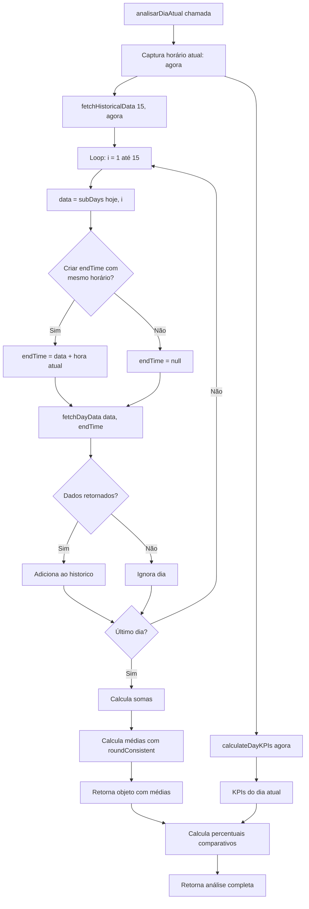

# Cálculo da Média dos Últimos 15 Dias

## 📋 Visão Geral

Este documento explica detalhadamente como o sistema **ReportsDAY** calcula a média dos últimos 15 dias para comparação com o dia atual. O cálculo considera o **horário exato** em que o relatório é gerado, garantindo uma comparação justa e precisa.

### Por que 15 dias?

- Representa aproximadamente **2 semanas úteis** de operação
- Fornece uma amostra estatisticamente relevante
- Balanceia entre dados recentes (relevância) e histórico suficiente (confiabilidade)

### Por que considerar o horário?

Quando um relatório é gerado às **10:00**, por exemplo, não faz sentido comparar os dados de hoje (até 10:00) com a média de dias completos (00:00 até 23:59). O sistema garante que:

- **Hoje**: Busca dados de 00:00 até 10:00
- **Histórico**: Busca dados de cada dia anterior de 00:00 até 10:00

Isso garante uma comparação **temporalmente alinhada** e precisa.

---

## 🔄 Fluxo de Execução

### 1. Captura do Horário de Referência

A função `analisarDiaAtual()` é o ponto de entrada principal:

```634:641:BACKEND/ReportsDAY-Backend-main/API-55PBX/service.js
export async function analisarDiaAtual() {
  console.log('📊 API-55PBX: Analisando dia atual vs histórico...');
  
  // Captura o horário atual UMA ÚNICA VEZ antes de buscar dados
  // Isso garante que hoje e histórico usem exatamente o mesmo horário
  const agora = new Date();
  const horaAtual = format(agora, 'HH:mm');
  console.log(`   ⏰ Horário de referência: ${horaAtual}`);
```

**Importante**: O horário é capturado **UMA ÚNICA VEZ** antes de qualquer busca de dados. Isso garante que todos os cálculos usem exatamente o mesmo momento como referência.

### 2. Busca de Dados Históricos

A função `fetchHistoricalData()` recebe o horário atual e busca os dados dos últimos 15 dias:

```501:515:BACKEND/ReportsDAY-Backend-main/API-55PBX/service.js
export async function fetchHistoricalData(days = 15, currentTime = null) {
  console.log(`📊 API-55PBX: Buscando histórico dos últimos ${days} dias...`);
  if (currentTime) {
    const horaFormatada = format(currentTime, 'HH:mm');
    console.log(`   ⏰ Considerando horário limite: ${horaFormatada}`);
    await sendLog(`📊 Carregando histórico (${days} dias até ${horaFormatada})...`, 'info');
  } else {
    await sendLog(`📊 Carregando histórico (${days} dias)...`, 'info');
  }
  
  const historico = [];
  const hoje = new Date();
  
  // Busca cada dia (começa do dia anterior, não inclui hoje)
  for (let i = 1; i <= days; i++) {
    const data = subDays(hoje, i);
```

**Observação**: O loop começa em `i = 1` (dia anterior) e vai até `i = 15` (15 dias atrás). **Não inclui o dia atual** na média histórica.

### 3. Aplicação do Horário Limite

Para cada dia histórico, o sistema cria um `endTime` com o mesmo horário do relatório atual:

```518:532:BACKEND/ReportsDAY-Backend-main/API-55PBX/service.js
    // Se currentTime fornecido, cria data limite com mesmo horário para este dia histórico
    let endTime = null;
    if (currentTime) {
      endTime = new Date(
        data.getFullYear(),
        data.getMonth(),
        data.getDate(),
        currentTime.getHours(),
        currentTime.getMinutes(),
        currentTime.getSeconds()
      );
      console.log(`   📅 Dia ${i}/${days}: ${format(data, 'dd/MM/yyyy')} até ${format(endTime, 'HH:mm')}`);
    } else {
      console.log(`   📅 Dia ${i}/${days}: ${format(data, 'dd/MM/yyyy')}`);
    }
```

**Exemplo prático**:
- Relatório gerado às **10:30:45** do dia 15/01/2026
- Para o dia 14/01/2026, busca dados de **00:00:00 até 10:30:45**
- Para o dia 13/01/2026, busca dados de **00:00:00 até 10:30:45**
- E assim por diante...

### 4. Busca de Dados de Cada Dia

A função `fetchDayData()` busca os dados específicos de cada dia até o horário limite:

```436:444:BACKEND/ReportsDAY-Backend-main/API-55PBX/service.js
export async function fetchDayData(date, endTime = null) {
  if (!isConfigured()) {
    return null;
  }
  
  try {
    const dateStart = startOfDay(date);
    // Se endTime fornecido, usa esse horário. Caso contrário, usa endOfDay (dia inteiro)
    const dateEnd = endTime || endOfDay(date);
```

Cada dia retorna um objeto com:
- `atendidas`: Total de chamadas atendidas (receptivo)
- `abandonadas`: Total de chamadas abandonadas na fila (receptivo)
- `retidasURA`: Total de chamadas retidas na URA (receptivo)
- `total`: `atendidas + abandonadas` (não inclui retidas URA)

---

## 📊 Cálculo da Média

### Fórmula Matemática

A média é calculada usando a fórmula aritmética simples:

```
Média = Soma dos Valores / Quantidade de Dias com Dados
```

### Implementação no Código

```550:563:BACKEND/ReportsDAY-Backend-main/API-55PBX/service.js
  // Calcula médias
  const somaAtendidas = historico.reduce((sum, d) => sum + d.atendidas, 0);
  const somaAbandonadas = historico.reduce((sum, d) => sum + d.abandonadas, 0);
  const somaRetidasURA = historico.reduce((sum, d) => sum + d.retidasURA, 0);
  const somaTotal = historico.reduce((sum, d) => sum + d.total, 0);
  
  // Log detalhado antes de calcular média
  console.log(`   📊 Somas calculadas (${historico.length} dias com dados de ${days} solicitados):`);
  console.log(`      Atendidas: ${somaAtendidas}, Abandonadas: ${somaAbandonadas}, Retidas URA: ${somaRetidasURA}, Total: ${somaTotal}`);
  
  const mediaAtendidas = roundConsistent(somaAtendidas / historico.length);
  const mediaAbandonadas = roundConsistent(somaAbandonadas / historico.length);
  const mediaRetidasURA = roundConsistent(somaRetidasURA / historico.length);
  const mediaTotal = roundConsistent(somaTotal / historico.length);
```

### Métricas Calculadas

O sistema calcula a média para **4 métricas principais**:

1. **Atendidas**: Média de chamadas atendidas por dia
2. **Abandonadas**: Média de chamadas abandonadas na fila por dia
3. **Retidas URA**: Média de chamadas retidas na URA por dia
4. **Total**: Média do total de chamadas (atendidas + abandonadas) por dia

### Tratamento de Dias sem Dados

**Importante**: Se um dia não retornar dados da API (por exemplo, erro de conexão ou dia sem ligações), ele **não é incluído** no array `historico`. Isso significa:

- Se solicitados 15 dias, mas apenas 12 retornaram dados, a média será calculada sobre **12 dias**
- A divisão usa `historico.length` (quantidade real de dias com dados), não o número solicitado

**Exemplo**:
- Solicitados: 15 dias
- Com dados: 12 dias
- Soma total: 1200 chamadas
- **Média = 1200 / 12 = 100 chamadas/dia** (não 1200 / 15 = 80)

---

## 💡 Exemplo Prático Completo

### Cenário

Relatório gerado em **15/01/2026 às 10:00:00**.

### Passo 1: Captura do Horário

```javascript
const agora = new Date('2026-01-15T10:00:00');
// horaAtual = "10:00"
```

### Passo 2: Busca dos Últimos 15 Dias

O sistema busca dados de cada dia anterior até 10:00:

| Dia | Data | Período Buscado | Dados Retornados |
|-----|------|-----------------|------------------|
| 1 | 14/01/2026 | 00:00 até 10:00 | atendidas: 85, abandonadas: 15, total: 100 |
| 2 | 13/01/2026 | 00:00 até 10:00 | atendidas: 92, abandonadas: 8, total: 100 |
| 3 | 12/01/2026 | 00:00 até 10:00 | atendidas: 78, abandonadas: 22, total: 100 |
| 4 | 11/01/2026 | 00:00 até 10:00 | atendidas: 88, abandonadas: 12, total: 100 |
| 5 | 10/01/2026 | 00:00 até 10:00 | atendidas: 90, abandonadas: 10, total: 100 |
| 6 | 09/01/2026 | 00:00 até 10:00 | atendidas: 82, abandonadas: 18, total: 100 |
| 7 | 08/01/2026 | 00:00 até 10:00 | atendidas: 95, abandonadas: 5, total: 100 |
| 8 | 07/01/2026 | 00:00 até 10:00 | atendidas: 87, abandonadas: 13, total: 100 |
| 9 | 06/01/2026 | 00:00 até 10:00 | atendidas: 91, abandonadas: 9, total: 100 |
| 10 | 05/01/2026 | 00:00 até 10:00 | atendidas: 79, abandonadas: 21, total: 100 |
| 11 | 04/01/2026 | 00:00 até 10:00 | atendidas: 86, abandonadas: 14, total: 100 |
| 12 | 03/01/2026 | 00:00 até 10:00 | atendidas: 93, abandonadas: 7, total: 100 |
| 13 | 02/01/2026 | 00:00 até 10:00 | atendidas: 84, abandonadas: 16, total: 100 |
| 14 | 01/01/2026 | 00:00 até 10:00 | atendidas: 89, abandonadas: 11, total: 100 |
| 15 | 31/12/2025 | 00:00 até 10:00 | atendidas: 88, abandonadas: 12, total: 100 |

### Passo 3: Cálculo das Somas

```javascript
somaAtendidas = 85 + 92 + 78 + 88 + 90 + 82 + 95 + 87 + 91 + 79 + 86 + 93 + 84 + 89 + 88
somaAtendidas = 1307

somaAbandonadas = 15 + 8 + 22 + 12 + 10 + 18 + 5 + 13 + 9 + 21 + 14 + 7 + 16 + 11 + 12
somaAbandonadas = 193

somaTotal = 100 + 100 + 100 + 100 + 100 + 100 + 100 + 100 + 100 + 100 + 100 + 100 + 100 + 100 + 100
somaTotal = 1500
```

### Passo 4: Cálculo das Médias

```javascript
quantidadeDias = 15

mediaAtendidas = roundConsistent(1307 / 15) = roundConsistent(87.133...) = 87
mediaAbandonadas = roundConsistent(193 / 15) = roundConsistent(12.866...) = 13
mediaTotal = roundConsistent(1500 / 15) = roundConsistent(100) = 100
```

### Passo 5: Comparação com o Dia Atual

Dados de hoje (15/01/2026 até 10:00):
- Atendidas: 95
- Abandonadas: 5
- Total: 100

**Percentual comparativo**:
```javascript
percentualAtendidas = roundConsistent((95 / 87) * 100) = roundConsistent(109.195...) = 109%
percentualTotal = roundConsistent((100 / 100) * 100) = roundConsistent(100) = 100%
```

**Resultado**: Hoje está **109% da média** em atendidas, ou seja, **9% acima da média**.

---

## 🔢 Arredondamento Consistente

### Função `roundConsistent()`

```16:18:BACKEND/ReportsDAY-Backend-main/API-55PBX/service.js
function roundConsistent(value) {
  return Math.round(value);
}
```

### Por que é Importante?

O arredondamento consistente garante que:
- Todos os cálculos usem a mesma regra (0.5 arredonda para cima)
- Os resultados sejam previsíveis e reprodutíveis
- Não haja discrepâncias entre diferentes partes do sistema

### Exemplos de Arredondamento

| Valor Original | `Math.round()` | Resultado |
|----------------|----------------|-----------|
| 87.133 | 87 | 87 |
| 87.5 | 88 | 88 |
| 87.6 | 88 | 88 |
| 12.866 | 13 | 13 |
| 12.4 | 12 | 12 |
| 109.195 | 109 | 109 |

### Onde é Aplicado?

1. **Médias históricas**: `roundConsistent(soma / quantidadeDias)`
2. **Percentuais comparativos**: `roundConsistent((valorAtual / media) * 100)`
3. **Todas as métricas numéricas** exibidas no sistema

---

## 📈 Cálculo de Percentuais Comparativos

Após calcular as médias, o sistema compara o dia atual com essas médias:

```658:662:BACKEND/ReportsDAY-Backend-main/API-55PBX/service.js
  // Calcula apenas percentuais comparativos (sem classificação de nível)
  const calcularPercentual = (valorAtual, media) => {
    if (media === 0) return 0;
    return roundConsistent((valorAtual / media) * 100);
  };
```

### Fórmula

```
Percentual = roundConsistent((Valor Atual / Média Histórica) * 100)
```

### Exemplos

| Valor Atual | Média Histórica | Cálculo | Percentual |
|-------------|-----------------|---------|------------|
| 95 | 87 | (95 / 87) * 100 = 109.195 | 109% |
| 50 | 100 | (50 / 100) * 100 = 50 | 50% |
| 150 | 100 | (150 / 100) * 100 = 150 | 150% |
| 0 | 100 | (0 / 100) * 100 = 0 | 0% |
| 100 | 0 | (retorna 0, evita divisão por zero) | 0% |

### Interpretação

- **100%**: Exatamente na média
- **> 100%**: Acima da média (ex: 150% = 50% acima)
- **< 100%**: Abaixo da média (ex: 50% = 50% abaixo)

---

## 🔍 Resumo do Fluxo Completo



---

## 📝 Notas Importantes

1. **Dias sem dados**: Se um dia não retornar dados, ele não é incluído na média. A divisão usa `historico.length`, não o número solicitado.

2. **Horário preciso**: O horário é capturado uma única vez e aplicado consistentemente a todos os dias históricos.

3. **Apenas receptivo**: Todos os cálculos consideram **apenas ligações receptivas** (report_01).

4. **Total não inclui retidas URA**: O campo `total` é calculado como `atendidas + abandonadas`. As `retidasURA` são uma métrica separada.

5. **Arredondamento uniforme**: Todos os valores numéricos passam por `roundConsistent()` para garantir consistência.

---

## 🔗 Referências de Código

- **Função principal**: `analisarDiaAtual()` - Linhas 634-705
- **Busca histórica**: `fetchHistoricalData()` - Linhas 501-584
- **Busca de dia**: `fetchDayData()` - Linhas 436-493
- **Arredondamento**: `roundConsistent()` - Linhas 16-18
- **Arquivo**: `BACKEND/ReportsDAY-Backend-main/API-55PBX/service.js`

---

**Última atualização**: Janeiro 2026  
**Versão do documento**: 1.0

